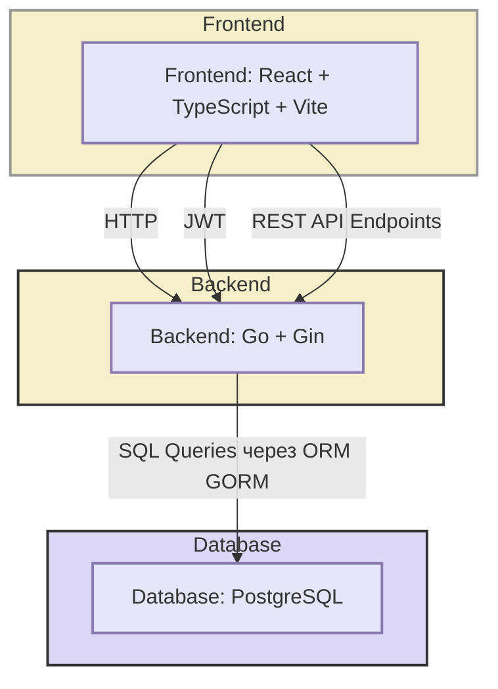
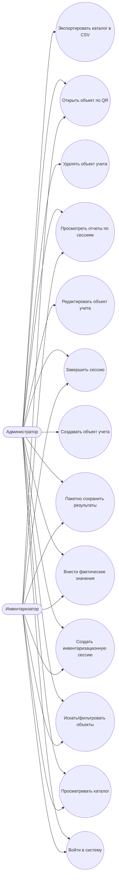

# Диаграммы для ВКР

Ниже собраны диаграммы в формате Mermaid для вставки в пояснительную записку.

## Архитектурная диаграмма (клиент-сервер)

## Диаграмма вариантов использования (для п. 1.1)

## Примечание

- Этот файл можно расширять: добавлять ER-диаграмму, диаграмму компонентов и другие схемы.
- Следующую диаграмму пришли в таком же формате, и я сразу добавлю ее сюда отдельным разделом.
